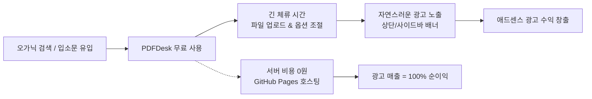

# PDFDesk 프로젝트 개요 및 기획 명세서 (PROJECT_OVERVIEW.md)

> **"보안 걱정 없는 완전 무료 PDF 실무 도구 & 서버비 0원 기반의 애드센스(AdSense) 수익화 웹 서비스"**

---

## 🎯 1. 프로젝트 목적 및 탄생 배경

### 1) 실무 현장의 고충 (Problem)
- **보안 유출 위험**: 건축·설계 도면, 기술 제안서, 견적서, 계약서 등을 다루는 실무자들은 PDF 편집/변환이 잦으나, 기존 온라인 도구(iLovePDF, Smallpdf 등)는 **파일을 외부 서버로 전송**하므로 사내 보안 규정 위반 및 데이터 유출 위험이 큼.
- **대용량 도면(최대 50MB, A0~A3) 처리 한계**: 제각각인 규격 도면을 A4 표준으로 통일하거나 원본 방향에 맞게 일괄 리사이징/병합해 주는 맞춤 도구가 부재함.
- **고가 라이선스 및 설치 제약**: Adobe Acrobat Pro 등 상용 프로그램은 비용이 높고, 업무용 PC에 임의 설치가 어려움.

### 2) PDFDesk의 해결책 (Solution)
- **100% 브라우저 클라이언트 사이드 (Zero Server Transfer)**:
  - 서버를 일절 거치지 않고 사용자 PC 브라우저 메모리(`pdf-lib`, `pdf.js`)에서만 직접 연산.
  - 도면과 문서 데이터가 외부 네트워크로 단 1바이트도 전송되지 않는 **절대적 보안** 제공.
- **현장 특화 실무 유틸리티**:
  - 도면 일괄 리사이징 & 자동 목차(TOC) 생성
  - 캔버스 기반 영구적 마스킹(Flatten)
  - 대용량 PDF 분할, 워터마크, 포맷 변환
  - 여러 작업을 한 번에 엮는 '올인원 파이프라인'

---

## 💰 2. 핵심 비즈니스 모델: 구글 애드센스(AdSense) 수익화

PDFDesk는 단순한 오픈소스 툴이 아니라, **지속 가능한 1인 웹 서비스로서 구글 애드센스를 통한 고수익 창출을 1차 목표**로 기획되었습니다.

### 1) 서버 비용 '0원' = 매출이 곧 100% 순수익 (High Margin)
- 일반 웹 서비스는 트래픽이 늘면 서버비(AWS 등)가 눈덩이처럼 불어나 적자가 나기 쉽습니다.
- PDFDesk는 연산을 사용자 PC가 대신하고 호스팅은 GitHub Pages(무료)를 이용하므로, **월 방문자가 수십만 명으로 늘어나도 서버 유지비는 항상 0원**입니다.
- 즉, **애드센스 수익 = 순이익(Cash-Cow)**이 되는 이상적인 사업 구조입니다.

### 2) 긴 체류 시간(Dwell Time)을 통한 광고 단가(eCPM) 극대화
- 단순 텍스트 블로그와 달리, PDF 유틸리티는 사용자가 파일을 올리고, 캔버스에서 미리보기를 탐색하고, 슬라이더를 맞추고, 파이프라인 단계를 진행하면서 **페이지 체류 시간이 극대화**됩니다.
- 체류 시간이 길수록 구글 애드센스의 스마트 프라이싱 알고리즘이 고단가 광고를 우선 매칭하며 eCPM/RPM이 상승합니다.

### 3) 전략적 광고 배치 및 규격화 (`PDFDesk.UI.adSlot`)
- **메인 랜딩 상단/중간**: 첫 진입 시 자연스러운 시선 유도
- **작업 화면(Workspace) 상단**: 가로형 리더보드 광고
- **설정 사이드바 하단**: 사용자가 컨트롤을 조작하는 동안 계속 시야에 머무는 사각 배너(MPU)
- **작업 실행 프로그레스 모달**: 변환이 진행되는 수 초간 사용자의 시선이 집중되는 골든 타임

### 4) 애드센스 심사 통과 및 오가닉 검색 유입(SEO/GEO) 최적화
- 빈 도구 페이지만 있으면 '가치 없는 콘텐츠'로 애드센스 심사에서 탈락하므로, 메인 하단에 **풍부한 기능 소개 문구와 SEO/GEO 친화적 FAQ(자주 묻는 질문) 마크업**을 유지합니다.

---

## 🏛️ 3. 기술 아키텍처 및 개발 원칙

1. **SPA (Single Page Application)**:
   - 물리적인 다중 HTML 파일 없이 `index.html` 단일 파일 내에서 자바스크립트 라우팅으로 화면 전환.
2. **공용 컴포넌트 시스템 (`js/uiComponents.js`)**:
   - `PDFDesk.UI`: 버튼, 카드, 인풋, 셀렉트, 슬라이더, 체크박스, 라디오, 안내박스, 광고슬롯 등 모든 UI를 모듈화하여 일관된 디자인과 재사용성 보장.
   - `PDFDesk.Utils`: 공용 다운로더(자동 메모리 해제), 통합 에러 핸들러, 파일명 정규화.
3. **디자인 시스템**:
   - Tailwind CSS + Material Design 3 (MD3) 스타일 가이드 준수.
4. **캐시 무력화 (Cache-Busting)**:
   - GitHub Pages의 강력한 브라우저 캐싱을 방지하기 위해 코드 수정 시 `index.html`의 쿼리스트링(`?v=X.X.X`)을 반드시 +1 업데이트.
5. **AI 에이전트 브라우저 자체 검증 (Self-Validation)**:
   - 코드 작업 후 가상 브라우저(Chrome DevTools)를 띄워 콘솔 에러(0건) 및 UI 작동 여부를 직접 검증 후 사용자에게 보고.

---

## 🛠️ 4. 주요 기능 모듈 명세

| 모듈 | 파일 | 핵심 기능 |
| :--- | :--- | :--- |
| **올인원 파이프라인** | `batchWorkspace.js` | 7종 작업(이미지 변환, 병합, 리사이징, 워터마크, 마스킹, 분할, 추출)을 원하는 순서대로 조합해 단계별 마법사 형태로 일괄 실행 |
| **용지 크기 통일 & 병합** | `resizeWorkspace.js` | A0~A4 강제 리사이징, 가로/세로 자동 판별 회전, 단순 병합, **한글 깨짐 없는 캔버스 렌더링 목차(TOC)** 생성 |
| **문서 마스킹 (Flatten)** | `maskingWorkspace.js` | 사각/원형/형광펜/지우개 도구로 민감 정보 가림 후, 캔버스 이미지(JPEG)로 영구 구워내기(Flatten) |
| **대용량 PDF 분할** | `splitWorkspace.js` | 썸네일 클릭을 통한 시각적 페이지 선택 또는 범위 지정 분할 후 ZIP 다운로드 |
| **워터마크** | `watermarkWorkspace.js` | 텍스트/이미지 워터마크, 크기·장평·회전각도·투명도 실시간 조절 및 일괄 적용 |
| **포맷 변환** | `convertWorkspace.js` | PDF ➔ JPG/PNG 이미지 추출 (ZIP), 여러 이미지 ➔ 단일 PDF 병합 |
| **공용 뷰어 엔진** | `sharedViewer.js` | 고해상도 PDF 렌더링, 돋보기(줌), 휠 클릭 패닝(이동) 공용 캔버스 보드 |
